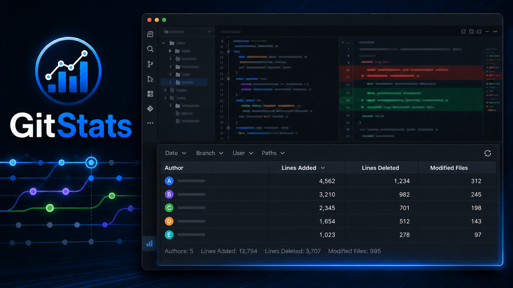

<p align="center">
  <a href="https://plugins.jetbrains.com/plugin/21806-gitstats" target="_blank" rel="noopener noreferrer">
    
  </a>
</p>

# GitStats

Git contribution statistics for IntelliJ Platform IDEs.

[![][jetbrains-version-shield]][jetbrains-plugin-link]
[![][jetbrains-downloads-shield]][jetbrains-plugin-link]
[![][github-release-date-shield]][github-release-date-link]
[![][github-action-build-shield]][github-action-build-link]
[![][github-license-shield]][github-license-link]

<!-- Plugin description -->
**Git activity statistics for JetBrains IDEs.**

GitStats turns the Git history of your current project into a clear author-level activity report inside the IDE. Review contribution trends, compare code changes across teammates, and share the visible results without leaving your development workflow.

- **Author-level summaries:** compare commits, added lines, deleted lines, and modified files.
- **Flexible date ranges:** inspect this week, the last 7 days, this month, or a custom range.
- **Author filtering:** narrow large repositories down to the contributors you want to review.
- **Two calculation modes:** use Fast Summary for quick line-based ranking, or Detailed mode when commit counts matter.
- **Noise control:** exclude generated folders, vendor code, build outputs, or any project-relative paths.
- **Shareable results:** copy selected rows, copy the full table, or export the visible statistics as CSV.

### Getting Started

1. Open a project backed by a Git repository in any supported JetBrains IDE.
2. Open the **Git Stats** tool window.
3. Choose a date range and optionally filter by author.
4. Click **Refresh** to calculate the report.
5. Use the settings action to switch modes or exclude noisy paths such as generated files and build outputs.

**Privacy-friendly by design:** GitStats uses the Git executable configured in your IDE and reads only local repository history. No source code, commit data, or statistics are sent to external services.
<!-- Plugin description end -->

## Why GitStats?

- Review Git contribution activity directly in the IDE.
- Filter statistics by start date and end date.
- Compare authors by commits, added lines, deleted lines, and modified files.
- Use `Fast Summary` mode for a quick ranking view, or `Detailed` mode when commit count is needed.
- Exclude noisy paths such as generated files, build outputs, or vendor directories.

## Installation

- Marketplace:

  Install from [JetBrains Marketplace][jetbrains-plugin-link], or open <kbd>Settings/Preferences</kbd> > <kbd>Plugins</kbd> > <kbd>Marketplace</kbd>, search for `GitStats`, then install the plugin.

- Manual installation:

  Download the [latest release](https://github.com/zhensherlock/intellij-platform-git-stats-plugin/releases/latest), then install it with
  <kbd>Settings/Preferences</kbd> > <kbd>Plugins</kbd> > <kbd>Install plugin from disk...</kbd>

## Usage

1. Open a Git-backed project in an IntelliJ Platform IDE.
2. Open the <kbd>Git Stats</kbd> tool window.
3. Pick the start and end dates for the reporting range.
4. Click <kbd>Refresh</kbd> to calculate the table.
5. Use the settings action to switch between `Fast Summary` and `Detailed`, or set excluded paths.

## Roadmap

See [ROADMAP.md](ROADMAP.md) for planned feature work and optimization areas.

## Development

Requirements:

- JDK 21
- IntelliJ IDEA 2024.2+ for local plugin development
- Gradle Wrapper from this repository

Useful commands:

```bash
./gradlew runIde
./gradlew check
./gradlew buildPlugin
./gradlew verifyPlugin
```

The current source configuration targets IntelliJ Platform builds `242` through `261.*`. Release artifacts are produced as `GitStats` plugin ZIP files under `build/distributions/`.

---

Built with the [IntelliJ Platform Plugin Template][template].

## Contributing

Feel free to dive in. [Open an issue](https://github.com/zhensherlock/intellij-platform-git-stats-plugin/issues/new/choose) or submit a pull request.

Standard Readme follows the [Contributor Covenant](http://contributor-covenant.org/version/1/3/0/) Code of Conduct.

### Contributors

This project exists thanks to all the people who contribute.

<a href="https://github.com/zhensherlock/intellij-platform-git-stats-plugin/graphs/contributors">
  
</a>

## License

[MIT](LICENSE) © MichaelSun

[jetbrains-plugin-link]: https://plugins.jetbrains.com/plugin/21806-gitstats
[jetbrains-version-shield]: https://img.shields.io/jetbrains/plugin/v/com.huayi.intellijplatform.gitstats?color=1677FF&labelColor=black&logo=jetbrains&logoColor=white&style=flat-square
[jetbrains-downloads-shield]: https://img.shields.io/jetbrains/plugin/d/com.huayi.intellijplatform.gitstats?color=1677FF&labelColor=black&style=flat-square
[github-release-date-link]: https://github.com/zhensherlock/intellij-platform-git-stats-plugin/releases
[github-release-date-shield]: https://img.shields.io/github/release-date/zhensherlock/intellij-platform-git-stats-plugin?color=1677FF&labelColor=black&style=flat-square
[github-action-build-link]: https://github.com/zhensherlock/intellij-platform-git-stats-plugin/actions/workflows/build.yml
[github-action-build-shield]: https://img.shields.io/github/actions/workflow/status/zhensherlock/intellij-platform-git-stats-plugin/build.yml?branch=main&color=1677FF&label=build&labelColor=black&logo=githubactions&logoColor=white&style=flat-square
[github-license-link]: https://github.com/zhensherlock/intellij-platform-git-stats-plugin/blob/main/LICENSE
[github-license-shield]: https://img.shields.io/github/license/zhensherlock/intellij-platform-git-stats-plugin?color=1677FF&labelColor=black&style=flat-square
[template]: https://github.com/JetBrains/intellij-platform-plugin-template
